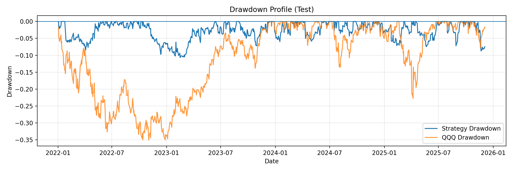

# QQQ Regime-Aware Systematic Strategy

A systematic, regime-aware trading strategy for the Nasdaq-100 (QQQ) that dynamically adjusts exposure based on trend, volatility, macro rates, and intraday market structure.

The strategy explicitly separates **overnight** and **intraday** risk, incorporates volatility targeting, and applies drawdown-aware risk controls inspired by institutional systematic trading frameworks.

---

## Strategy Overview

This model combines multiple orthogonal signals to determine both **direction** and **position size**:

### Core Components
- **Trend Regime**: Long/short bias using a 200-day moving average
- **Volatility Regime (VIX)**: Exposure adjustments during calm, transition, and panic states
- **Macro Filter (Rates)**: 20Y Treasury yield trend and equity–rates correlation
- **Momentum & Serial Dependence**: Medium-term momentum and return autocorrelation
- **Risk Overlay ("Iron Dome")**: Automatic leverage reduction during extreme volatility

### Execution Logic
- **Overnight Positioning**: Determined at market close using regime signals
- **Intraday Trading**: Gap-based logic that fades small gaps and follows large gaps
- **Volatility Targeting**:
  - Bull regime: ~25% annualized target volatility (max 3x leverage)
  - Bear regime: ~15% annualized target volatility (max 1x leverage)

---

## Backtest Configuration

- **Universe**: QQQ
- **Data Sources**:
  - QQQ OHLCV (train/validation + blind test)
  - VIX index
  - 20Y Treasury Yield (DGS20)
- **Test Period**: 2022-01-01 to 2025-12-04
- **Benchmark**: Buy-and-hold QQQ
- **Transaction Costs**: Not included (gross performance)

---

## Results Summary

| Metric        | Strategy | QQQ Benchmark |
|--------------|----------|---------------|
| CAGR         | 24.63%   | 13.03%        |
| Sharpe Ratio | 1.62     | 0.63          |
| Calmar Ratio | 2.32     | 0.38          |
| Max Drawdown | -10.63%  | -33.97%       |

---

## Performance Plots

### Equity Curve (Log Scale)


### Drawdown Comparison


---

## Notes & Disclaimers

This project is a research prototype intended for educational and exploratory purposes only.

All reported results are **gross of transaction costs, slippage, and financing costs**, and therefore may not be representative of live trading performance.

No claim is made regarding the profitability or robustness of this strategy in real-world trading environments. Past performance does not guarantee future results.


## How to Run

```bash
git clone https://github.com/VirtualHelix/qqq-regime-aware-strategy.git
cd qqq-regime-aware-strategy
python3.12 -m venv venv
source venv/bin/activate
pip install -r requirements.txt
python qqq.py


